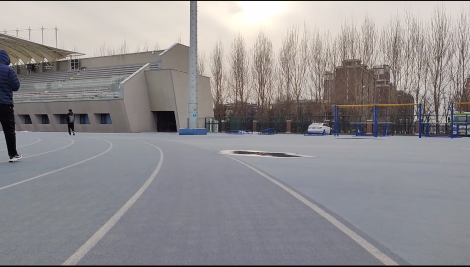
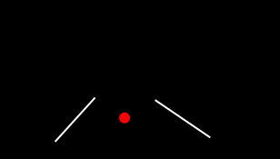
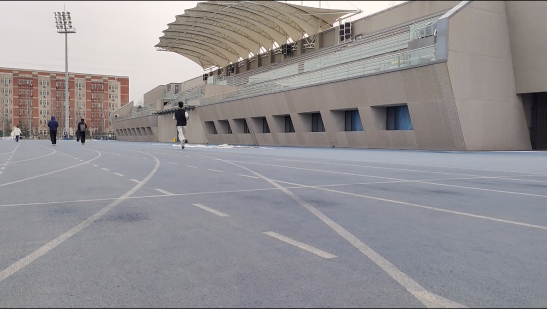
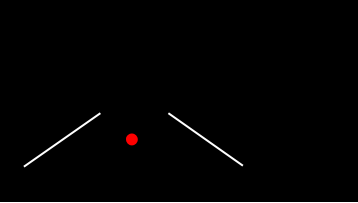
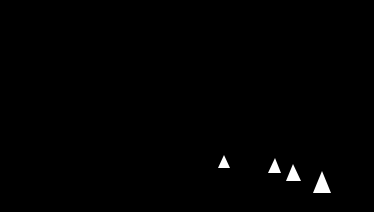
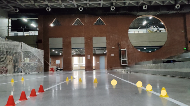

# 东北大学室外5G组招新考核2026

## 任务

### 一、迷宫求解（13%）

从任意渠道获取一张黑白迷宫的图片，然后编写cpp代码对其进行求解。要求如下：
  - 迷宫形状任意，但是不能过于简单。
  - 代码的输入为迷宫的图片文件，输出为画出路线的迷宫图片，路线颜色为红色。

### 二、opencv的图像处理（58%）

1.操场跑道线的处理

根据**操场.mp4**给出的跑道视频，编写一份cpp代码对其进行处理。要求如下：
  - 输出为二值化后的黑白视频，其中跑道线在视频中为白色，其他为黑色，两条跑道线的中央（即目标点）为红色小点。
  - 输出的白色跑道线可以是直线，也可以是曲线，但是视频中应只存在本条跑道两侧的跑道线。

2.锥桶的识别与跟踪

根据**锥桶-室内一楼.mp4**，**锥桶-室内二楼.mp4**，**锥桶-室外.mp4**给出的三份不同环境下的锥桶导航视频，编写一份cpp代码对三份视频进行处理。要求如下：
  - 要求用相同的代码处理三份不同的视频，其间代码中的参数不能有任何改动，以此模拟不同光照环境下的锥桶识别与导航。
  - 输出为三份二值化后的黑白视频，其中黄色锥桶在视频中为白色，其他为黑色，蓝色或红色锥桶颜色任意（可以被识别，即白色；也可以被过滤，即黑色）。
  - 在每一帧图像中至少能识别出一个黄色锥桶，并且该锥桶在黑白视频中的白色面积不能过小，直到原视频中几乎看不到任何黄色锥桶的存在。

### 三、yolov5的简单使用（29%）

根据dataset中的左右转弯标志的数据集，利用yolov5或者yolov5 lite算法完成模型的构建。要求如下：
  - 需要自己完成数据集的预处理，比如图片的筛选，数量的确定，训练集与测试集的分类等。
  - 最终测试集每张图片的置信率不得低于0.5，或者平均置信率在0.6以上。
  - 不得增加或修改数据集中图片的任何内容，但可以进行适当的删减，以提高数据集的质量。

## 给分细则

### 一、迷宫求解

  - 若迷宫为运用代码随机生成，适当予以加分，但不超过本题满分，且迷宫生成代码和求解代码不能为一个文件。
  - 相同求解速度下，迷宫越大越难，给分越高；相同迷宫面积或难度下（近似相同），求解速度越快，给分越高。
  - 若代码不是cpp，不给分。
  - 输出可以是图片格式中的任意格式，如png,jpg,jpeg等；若输出不是图片格式但可以表示正确路线，适当给分。

### 二、操场跑道线的处理

  - 只要输出视频经过了二值化，并且能较为明显的看到跑道的相对位置和形状，即给分。
  - 输出的视频中除了白色的跑道线应尽量没有其他白色噪点和杂线。噪点越少，给分越高。当视频中从头到尾几乎只有需要的跑道线时，本题给满分。示意图如下图所示。

  - 若视频中红色小点出现长时间偏离跑道中央位置，根据偏离的时长和距离适当扣分。
  - 若在跑道中间出现了白色杂线，即识别到了不需要的且存在干扰的跑道线，根据错误识别的时长进行适当扣分。
  - 若认为自己的代码可以有效对抗光照变化的干扰，可在邮件与代码中进行说明和注释，或者线下进行讲解。当我们认可后，可适当进行加分（额外计算）。

### 三、锥桶的识别与跟踪

  - 只要输出视频经过了二值化，且能较为明显的看到锥桶的相对位置和形状，即给分。示意图如图所示。

  - 一般情况下，每一帧可同时识别到1-4个黄色锥桶，平均识别的数量越多，给分越高。
  - 三个视频大致模拟不同环境下的识别。若适配的视频越多，效果越好，给分越高。
  - 若输出不是二值化后的黑白视频，只要可以明确表示出锥桶在图像中的位置，如在原视频上用圆点表示锥桶位置，同样给分，且根据处理难度适当予以加分，不超过满分。示意图如图所示。

### 四、yolov5的简单使用

  - 输出应包含每张图片的置信率或者在最终结果输出中有平均置信率，未达到要题目要求的适当扣分。
  - 若给出了数据集预处理后的文件层次，给适当的分数。
  - 若生成了模型文件并且可以识别测试集中的图片，给适当的分数。
  - 在答案中应有文件证明达到了题目的要求。生成模型文件并达到题目要求的给满分。

### 五、审核与提交

  - 所有参与考核的同学不得互相抄袭，一旦发现答案有雷同之处，直接取消相关同学的考核资格。
  - 不得存在多个同学分工合作使其中一个同学获得极高的分数的现象，一旦发现直接取消相关同学的考核资格。
  - 可以使用ai。
  - 考核持续**15天**，即**3月20日23:59截止**，代码和相关文件可发送至**2968088988@qq.com**邮箱；或者放到自己的github仓库中，并将**仓库链接**发给我（施佳成）。
  - 可以自行选择仅线上提交或者线上提交后进行线下演示，若选择线下演示会根据情况适当加分（额外计算）。
  - 提交自己认为所有可以证明的相关文件。
